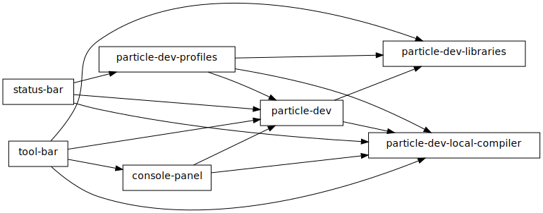

# Desktop IDE services

All packages that the Desktop IDE consists of communicate using [Atom's Services API](http://blog.atom.io/2015/03/25/new-services-API.html). The graph of service providers and consumers looks like this:

## Necessary services

Some services might be necessary for a package to work (`particle-dev-profiles` for example which provides user auth). In this case a package might use promises to defer the initialization until the required package has been provided. Drawback of this method is that the package can hang if the providing service is not installed. Currently there's now way (officially) to check if a package is installed therefore we're using [`atom-package-deps`](https://www.npmjs.com/package/atom-package-deps) package to prompt user to install those.

## Optional services

Some packages (like `tool-bar`) are not necessary for the whole IDE to work and therefore should not block the initialization and the IDE should keep working even if those are missing.
